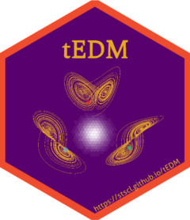

# tEDM <a href="https://stscl.github.io/tEDM/"></a>

<!-- badges: start -->

[](https://CRAN.R-project.org/package=tEDM)
[](https://CRAN.R-project.org/package=tEDM)
[](https://cran.r-project.org/web/checks/check_results_tEDM.html)
[](https://CRAN.R-project.org/package=tEDM)
[](https://CRAN.R-project.org/package=tEDM)
[](http://www.gnu.org/licenses/gpl-3.0.html)
[](https://github.com/stscl/tEDM/actions/workflows/R-CMD-check.yaml)
[](https://lifecycle.r-lib.org/articles/stages.html#stable)
[](https://stscl.r-universe.dev/tEDM)
[](https://doi.org/10.1016/j.compenvurbsys.2026.102435)
[](https://doi.org/10.5281/zenodo.18252239)

<!-- badges: end -->

_**T**emporal **E**mpirical **D**ynamic **M**odeling_

## Overview

The `tEDM` package provides a suite of tools for exploring and quantifying causality in time series using Empirical Dynamic Modeling (EDM). It is particularly designed to detect, differentiate, and reconstruct causal dynamics in systems where traditional assumptions of linearity and stationarity may not hold.

The package implements four fundamental EDM-based methods:

- [**Convergent Cross Mapping (CCM)**][1] – for detecting nonlinear causal relationships in time series.

- [**Partial Cross Mapping (PCM)**][2] – for disentangling direct from indirect causal influences.

- [**Cross Mapping Cardinality (CMC)**][3] – for identifying time-varying or state-dependent causal linkages.

- [**Multispatial Convergent Cross Mapping (MultispatialCCM)**][4] – for reconstructing causal dynamics from replicated time series across multiple spatial locations.

> *Refer to the package documentation <https://stscl.github.io/tEDM/> for more detailed information.*

## Installation

- Install from [CRAN](https://CRAN.R-project.org/package=tEDM) with:

``` r
install.packages("tEDM", dep = TRUE)
```

- Install binary version from [R-universe](https://stscl.r-universe.dev/tEDM) with:

``` r
install.packages("tEDM",
                 repos = c("https://stscl.r-universe.dev",
                           "https://cloud.r-project.org"),
                 dep = TRUE)
```

- Install from source code on [GitHub](https://github.com/stscl/tEDM) with:

```r
if (!requireNamespace("devtools")) {
    install.packages("devtools")
}
devtools::install_github("stscl/tEDM",
                         build_vignettes = TRUE,
                         dep = TRUE)
```

## CITATION

Please cite **[tEDM][5]** as:

```
Lyu, W., Lei, Y., Yi, W., Song, Y., Li, X., Dai, S., Qin, Y., Zhao, W., 2026. Causal discovery in urban data with temporal empirical dynamic modeling: The R package tEDM. Computers, Environment and Urban Systems 127, 102435. https://doi.org/10.1016/j.compenvurbsys.2026.102435
```

A BibTeX entry for LaTeX users is:

``` bib
@article{lyu2026tEDM, 
    title = {Causal discovery in urban data with temporal empirical dynamic modeling: The {R} package {tEDM}}, 
    volume = {127}, 
    ISSN = {0198-9715}, 
    DOI = {10.1016/j.compenvurbsys.2026.102435}, 
    journal = {Computers, Environment and Urban Systems},
    publisher = {Elsevier BV}, 
    author = {Lyu, Wenbo and Lei, Yangyang and Yi, Wen and Song, Yongze and Li, Xiao and Dai, Shaoqing and Qin, Yiming and Zhao, Wufan}, 
    year = {2026}, 
    month = {jul}, 
    pages = {102435} 
}
```

## Reference

Lyu, W., Lei, Y., Yi, W., Song, Y., Li, X., Dai, S., Qin, Y., Zhao, W., 2026. Causal discovery in urban data with temporal empirical dynamic modeling: The R package tEDM. Computers, Environment and Urban Systems 127, 102435. [https://doi.org/10.1016/j.compenvurbsys.2026.102435][5].

Sugihara, G., May, R., Ye, H., Hsieh, C., Deyle, E., Fogarty, M., Munch, S., 2012. Detecting Causality in Complex Ecosystems. Science 338, 496–500. [https://doi.org/10.1126/science.1227079][1].

Leng, S., Ma, H., Kurths, J., Lai, Y.-C., Lin, W., Aihara, K., Chen, L., 2020. Partial cross mapping eliminates indirect causal influences. Nature Communications 11. [https://doi.org/10.1038/s41467-020-16238-0][2].

Tao, P., Wang, Q., Shi, J., Hao, X., Liu, X., Min, B., Zhang, Y., Li, C., Cui, H., Chen, L., 2023. Detecting dynamical causality by intersection cardinal concavity. Fundamental Research. [https://doi.org/10.1016/j.fmre.2023.01.007][3].

Clark, A.T., Ye, H., Isbell, F., Deyle, E.R., Cowles, J., Tilman, G.D., Sugihara, G., 2015. Spatial convergent cross mapping to detect causal relationships from short time series. Ecology 96, 1174–1181. [https://doi.org/10.1890/14-1479.1][4].

&nbsp; 

[1]: https://doi.org/10.1126/science.1227079
[2]: https://doi.org/10.1038/s41467-020-16238-0
[3]: https://doi.org/10.1016/j.fmre.2023.01.007
[4]: https://doi.org/10.1890/14-1479.1
[5]: https://doi.org/10.1016/j.compenvurbsys.2026.102435
