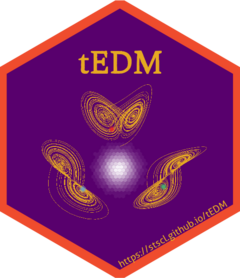

# tEDM [](https://stscl.github.io/tEDM/)

***T**emporal **E**mpirical **D**ynamic **M**odeling*

## Overview

The `tEDM` package provides a suite of tools for exploring and
quantifying causality in time series using Empirical Dynamic Modeling
(EDM). It is particularly designed to detect, differentiate, and
reconstruct causal dynamics in systems where traditional assumptions of
linearity and stationarity may not hold.

The package implements four fundamental EDM-based methods:

- [**Convergent Cross Mapping
  (CCM)**](https://doi.org/10.1126/science.1227079) – for detecting
  nonlinear causal relationships in time series.

- [**Partial Cross Mapping
  (PCM)**](https://doi.org/10.1038/s41467-020-16238-0) – for
  disentangling direct from indirect causal influences.

- [**Cross Mapping Cardinality
  (CMC)**](https://doi.org/10.1016/j.fmre.2023.01.007) – for identifying
  time-varying or state-dependent causal linkages.

- [**Multispatial Convergent Cross Mapping
  (MultispatialCCM)**](https://doi.org/10.1890/14-1479.1) – for
  reconstructing causal dynamics from replicated time series across
  multiple spatial locations.

> *Refer to the package documentation <https://stscl.github.io/tEDM/>
> for more detailed information.*

## Installation

- Install from [CRAN](https://CRAN.R-project.org/package=tEDM) with:

``` r
install.packages("tEDM", dep = TRUE)
```

- Install binary version from
  [R-universe](https://stscl.r-universe.dev/tEDM) with:

``` r
install.packages("tEDM",
                 repos = c("https://stscl.r-universe.dev",
                           "https://cloud.r-project.org"),
                 dep = TRUE)
```

- Install from source code on [GitHub](https://github.com/stscl/tEDM)
  with:

``` r
if (!requireNamespace("devtools")) {
    install.packages("devtools")
}
devtools::install_github("stscl/tEDM",
                         #build_vignettes = TRUE,
                         dep = TRUE)
```

## Reference

Sugihara, G., May, R., Ye, H., Hsieh, C., Deyle, E., Fogarty, M., Munch,
S., 2012. Detecting Causality in Complex Ecosystems. Science 338,
496–500. <https://doi.org/10.1126/science.1227079>.

Leng, S., Ma, H., Kurths, J., Lai, Y.-C., Lin, W., Aihara, K., Chen, L.,
2020. Partial cross mapping eliminates indirect causal influences.
Nature Communications 11. <https://doi.org/10.1038/s41467-020-16238-0>.

Tao, P., Wang, Q., Shi, J., Hao, X., Liu, X., Min, B., Zhang, Y., Li,
C., Cui, H., Chen, L., 2023. Detecting dynamical causality by
intersection cardinal concavity. Fundamental Research.
<https://doi.org/10.1016/j.fmre.2023.01.007>.

Clark, A.T., Ye, H., Isbell, F., Deyle, E.R., Cowles, J., Tilman, G.D.,
Sugihara, G., 2015. Spatial convergent cross mapping to detect causal
relationships from short time series. Ecology 96, 1174–1181.
<https://doi.org/10.1890/14-1479.1>.

 
