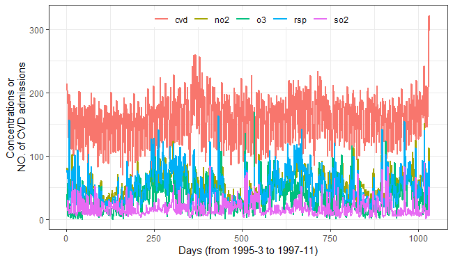
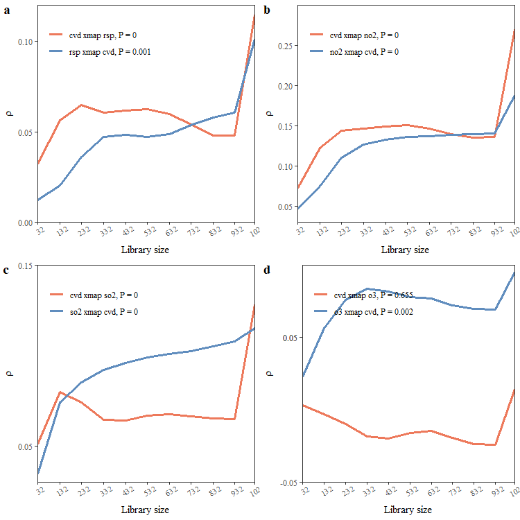
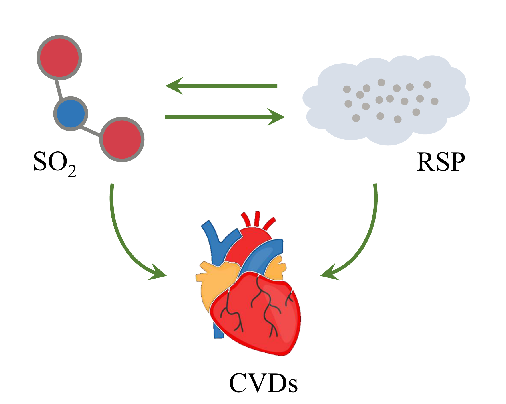
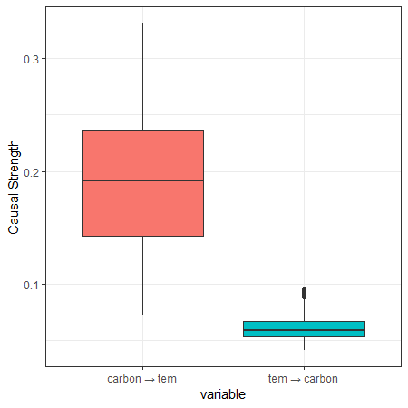
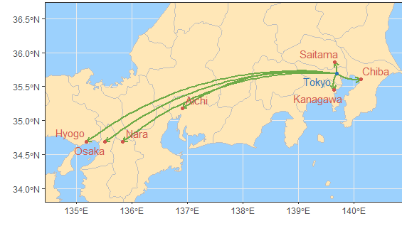

## 1. Introduction to the `tEDM` package

The `tEDM` package provides a suite of tools for exploring and quantifying causality in time series using Empirical Dynamic Modeling (EDM). It implements four fundamental EDM-based causal discovery methods:

- [**Convergent Cross Mapping (CCM)**][1]

- [**Partial Cross Mapping (PCM)**][2]

- [**Cross Mapping Cardinality (CMC)**][3]

- [**Multispatial Convergent Cross Mapping (MultispatialCCM)**][4]

These methods enable researchers to:

- **Identify** potential causal interactions without assuming a predefined model structure.

- **Distinguish** between direct causation and indirect (mediated or confounded) influences.

- **Reconstruct** underlying causal dynamics from replicated univariate time series observed across multiple spatial units.

## 2. Example data in the `tEDM` package

### Hong Kong Air Pollution and Cardiovascular Admissions

A daily time series dataset(from 1995-3 to 1997-11) for Hong Kong that includes cardiovascular hospital admissions and major air pollutant concentrations.

**File**: `cvd.csv`

**Columns**:

| Column | Description                                                 |
| ------ | ----------------------------------------------------------- |
| `cvd`  | Daily number of cardiovascular-related hospital admissions. |
| `rsp`  | Respirable suspended particulates (μg/m³).                  |
| `no2`  | Nitrogen dioxide concentration (μg/m³).                     |
| `so2`  | Sulfur dioxide concentration (μg/m³).                       |
| `o3`   | Ozone concentration (μg/m³).                                |

**Source**: Data adapted from [PCM article][2].

---

### US County-Level Carbon Emissions Dataset

A panel dataset covering U.S. county-level temperature and carbon emissions across time.

**File**: `carbon.csv.gz`

**Columns**:

| Column   | Description                                                              |
| -------- | ------------------------------------------------------------------------ |
| `year`   | Observation year (1981–2017).                                            |
| `fips`   | County FIPS code (5-digit Federal Information Processing Standard code). |
| `tem`    | Mean annual temperature (in Kelvin).                                     |
| `carbon` | Total carbon emissions per year (in kilograms of CO₂).                   |

**Source**: Data adapted from [FsATE article][5].

---

### COVID-19 Infection Counts in Japan

A spatio-temporal dataset capturing the number of confirmed COVID-19 infections across Japan’s 47 prefectures over time.

**File**: `covid.csv`

**Structure**:

* Each **column** represents one of the 47 Japanese prefectures (e.g., `Tokyo`, `Osaka`, `Hokkaido`).
* Each **row** corresponds to a time step (daily).

**Source**: Data adapted from [CMC article][3].

## 3. Case studies of the `tEDM` package

Install the stable version:

```r
install.packages("tEDM", dep = TRUE)
```

or dev version:

```r
install.packages("tEDM",
                 repos = c("https://stscl.r-universe.dev",
                           "https://cloud.r-project.org"),
                 dep = TRUE)
```

### Air Pollution and Cardiovascular Health in Hong Kong

Employing CCM, CMC and PCM to investigate the causal relationships between various air pollutants and cardiovascular diseases:


``` r
library(tEDM)

cvd = readr::read_csv(system.file("case/cvd.csv",package = "tEDM"))
## Rows: 1032 Columns: 5
## ── Column specification ─────────────────────────────────────────────────────────
## Delimiter: ","
## dbl (5): cvd, rsp, no2, so2, o3
## 
## ℹ Use `spec()` to retrieve the full column specification for this data.
## ℹ Specify the column types or set `show_col_types = FALSE` to quiet this message.
head(cvd)
## # A tibble: 6 × 5
##     cvd   rsp   no2   so2    o3
##   <dbl> <dbl> <dbl> <dbl> <dbl>
## 1   214  73.7  74.5  19.1 17.4 
## 2   203  77.6  80.9  18.8 39.4 
## 3   202  64.8  67.1  13.8 56.4 
## 4   182  68.8  74.7  30.8  5.6 
## 5   181  49.4  62.3  23.1  3.6 
## 6   129  67.4  63.6  17.4  6.73
```


``` r
cvd_long = cvd |>
  tibble::rowid_to_column("id") |>
  tidyr::pivot_longer(cols = -id,
                      names_to = "variable", values_to = "value")

fig1 = ggplot2::ggplot(cvd_long, ggplot2::aes(x = id, y = value, color = variable)) +
  ggplot2::geom_line(linewidth = 1) +
  ggplot2::labs(x = "Days (from 1995-3 to 1997-11)", y = "Concentrations or \nNO. of CVD admissions", color = "") +
  ggplot2::theme_bw() +
  ggplot2::theme(legend.direction = "horizontal",
                 legend.position = "inside",
                 legend.justification = c("center","top"),
                 legend.background = ggplot2::element_rect(fill = "transparent", color = NA))
fig1
```



Determining optimal embedding dimension:


``` r
tEDM::fnn(cvd,"cvd",E = 2:50,eps = stats::sd(cvd$cvd))
##       E:1       E:2       E:3       E:4       E:5       E:6       E:7       E:8 
## 0.8275862 0.4944072 0.3044807 0.2902240 0.2148676 0.2067210 0.1945010 0.1853360 
##       E:9      E:10      E:11      E:12      E:13      E:14      E:15      E:16 
## 0.1863544 0.1894094 0.1832994 0.1843177 0.1782077 0.1710794 0.1680244 0.1680244 
##      E:17      E:18      E:19      E:20      E:21      E:22      E:23      E:24 
## 0.1547862 0.1537678 0.1670061 0.1568228 0.1588595 0.1710794 0.1639511 0.1659878 
##      E:25      E:26      E:27      E:28      E:29      E:30      E:31      E:32 
## 0.1670061 0.1873727 0.1659878 0.1751527 0.1731161 0.1812627 0.1710794 0.1802444 
##      E:33      E:34      E:35      E:36      E:37      E:38      E:39      E:40 
## 0.1700611 0.1720978 0.1710794 0.1629328 0.1517312 0.1639511 0.1670061 0.1700611 
##      E:41      E:42      E:43      E:44      E:45      E:46      E:47      E:48 
## 0.1659878 0.1649695 0.1670061 0.1690428 0.1619145 0.1670061 0.1792261 0.1822811 
##      E:49 
## 0.1761711
```

Starting at $E = 11$, the FNN ratio stabilizes near 0.18; thus, embedding dimension E and neighbor number k are chosen from 11 onward for subsequent self-prediction parameter selection.


``` r
tEDM::simplex(cvd,"cvd","cvd",E = 11:35,k = 12:36)
## The suggested E and k for variable cvd is 11 and 12
tEDM::simplex(cvd,"rsp","rsp",E = 11:35,k = 12:36)
## The suggested E and k for variable rsp is 11 and 13
tEDM::simplex(cvd,"no2","no2",E = 11:35,k = 12:36)
## The suggested E and k for variable no2 is 11 and 12
tEDM::simplex(cvd,"so2","so2",E = 11:35,k = 12:36)
## The suggested E and k for variable so2 is 11 and 18
tEDM::simplex(cvd,"o3","o3",E = 11:35,k = 12:36)
## The suggested E and k for variable o3 is 11 and 12
```

We first use CCM to explore the causal influences of air pollutants on the incidence of cardiovascular diseases.


``` r
rsp_cvd = tEDM::ccm(cvd,"rsp","cvd",libsizes = seq(32,1032,100),E = 11,k = c(13,12),progressbar = FALSE)
rsp_cvd
##    libsizes   rsp->cvd   cvd->rsp
## 1        32 0.03212919 0.01228767
## 2       132 0.05654363 0.02018887
## 3       232 0.06463454 0.03607634
## 4       332 0.06064099 0.04698896
## 5       432 0.06180930 0.04813387
## 6       532 0.06262916 0.04713303
## 7       632 0.05983990 0.04859066
## 8       732 0.05386418 0.05365310
## 9       832 0.04783700 0.05779265
## 10      932 0.04788904 0.06048993
## 11     1021 0.11465191 0.10133554
no2_cvd = tEDM::ccm(cvd,"no2","cvd",libsizes = seq(32,1032,100),E = 11,k = 12,progressbar = FALSE)
no2_cvd
##    libsizes  no2->cvd   cvd->no2
## 1        32 0.0725866 0.04646570
## 2       132 0.1223500 0.07452473
## 3       232 0.1440400 0.10979245
## 4       332 0.1463108 0.12676364
## 5       432 0.1493368 0.13259880
## 6       532 0.1505781 0.13601417
## 7       632 0.1463268 0.13721917
## 8       732 0.1392535 0.13837513
## 9       832 0.1352347 0.13943520
## 10      932 0.1359023 0.14033241
## 11     1021 0.2701247 0.18804876
so2_cvd = tEDM::ccm(cvd,"so2","cvd",libsizes = seq(32,1032,100),E = 11,k = c(18,12),progressbar = FALSE)
so2_cvd
##    libsizes   so2->cvd   cvd->so2
## 1        32 0.05100118 0.03461720
## 2       132 0.07979493 0.07406730
## 3       232 0.07390120 0.08535797
## 4       332 0.06454759 0.09205499
## 5       432 0.06421670 0.09589412
## 6       532 0.06667487 0.09915476
## 7       632 0.06752325 0.10104920
## 8       732 0.06628738 0.10265838
## 9       832 0.06534601 0.10523615
## 10      932 0.06505378 0.10782963
## 11     1021 0.12820854 0.11510196
o3_cvd = tEDM::ccm(cvd,"o3","cvd",libsizes = seq(32,1032,100),E = 11,k = 12,progressbar = FALSE)
o3_cvd
##    libsizes      o3->cvd    cvd->o3
## 1        32  0.002955184 0.02271010
## 2       132 -0.002839356 0.05643341
## 3       232 -0.009653301 0.07583492
## 4       332 -0.018512914 0.08387571
## 5       432 -0.019942039 0.08175905
## 6       532 -0.015815466 0.07819425
## 7       632 -0.014698935 0.07679967
## 8       732 -0.019196844 0.07226140
## 9       832 -0.023726153 0.06974574
## 10      932 -0.024137957 0.06943232
## 11     1021  0.013982373 0.09503517
```


``` r
figa = plot(rsp_cvd,ylimits = c(0,0.12),ybreaks = c(0,0.05,0.10))
figb = plot(no2_cvd,ylimits = c(0.03,0.30),ybreaks = seq(0.05,0.25,0.05))
figc = plot(so2_cvd,ylimits = c(0.03,0.15),ybreaks = c(0,0.15,0.05))
figd = plot(o3_cvd,ylimits = c(-0.05,0.1),ybreaks = c(-0.05,0.05,0.05))

fig2 = cowplot::plot_grid(figa, figb, figc, figd, ncol = 2,
                         label_fontfamily = 'serif',
                         labels = letters[1:4])
fig2
```



The results shown in Figure2 indicate the presence of the following causal influences:

- rsp → cvd
- no₂ → cvd
- so₂ → cvd
- cvd → rsp
- cvd → no₂
- cvd → so₂
- cvd → o₃

However, based on practical experience, the relationship between CVDs and air pollution is likely reflective rather than causal. Therefore, we further employ CCM to examine the causal paths of cvd → no₂ and cvd → o₃.


``` r
g1 = tEDM::cmc(cvd,"rsp","cvd",E = 11,k = 50,progressbar = FALSE)
g1
##   neighbors rsp->cvd cvd->rsp
## 1        50    0.364   0.4696
g1$xmap
##   neighbors x_xmap_y_mean x_xmap_y_sig x_xmap_y_upper x_xmap_y_lower
## 1        50        0.4696     0.645344      0.5990605      0.3401395
##   y_xmap_x_mean y_xmap_x_sig y_xmap_x_upper y_xmap_x_lower
## 1         0.364   0.03509439      0.4904932      0.2375068

g2 = tEDM::cmc(cvd,"so2","cvd",E = 11,k = 50,progressbar = FALSE)
g2
##   neighbors so2->cvd cvd->so2
## 1        50    0.046     0.46
g2$xmap
##   neighbors x_xmap_y_mean x_xmap_y_sig x_xmap_y_upper x_xmap_y_lower
## 1        50          0.46    0.5434416      0.5890263      0.3309737
##   y_xmap_x_mean y_xmap_x_sig y_xmap_x_upper y_xmap_x_lower
## 1         0.046 3.508029e-77      0.0938521              0

g3 = tEDM::cmc(cvd,"no2","cvd",E = 11,k = 50,progressbar = FALSE)
g3
##   neighbors no2->cvd cvd->no2
## 1        50   0.2728    0.446
g3$xmap
##   neighbors x_xmap_y_mean x_xmap_y_sig x_xmap_y_upper x_xmap_y_lower
## 1        50         0.446    0.4123805      0.5751162      0.3168838
##   y_xmap_x_mean y_xmap_x_sig y_xmap_x_upper y_xmap_x_lower
## 1        0.2728 0.0001114126      0.3880356      0.1575644

g4 = tEDM::cmc(cvd,"o3","cvd",E = 11,k = 50,progressbar = FALSE)
g4
##   neighbors o3->cvd cvd->o3
## 1        50  0.0536  0.4628
g4$xmap
##   neighbors x_xmap_y_mean x_xmap_y_sig x_xmap_y_upper x_xmap_y_lower
## 1        50        0.4628    0.5733574      0.5922777      0.3333223
##   y_xmap_x_mean y_xmap_x_sig y_xmap_x_upper y_xmap_x_lower
## 1        0.0536 8.756939e-60      0.1072525              0
```

The causal paths from CVDs to air pollutants are not statistically significant in the CMC analysis results, allowing us to rule out these four directions. Meanwhile, the causal strength from SO₂ to CVDs is too weak (approximately 0.05), excluding the existence of a causal path from SO₂ to CVDs. Therefore, we conclude that only RSP and NO₂ exhibit causal influences on CVDs, with no evidence of feedback causality.

We further aim to explore the potential causal interactions among different air pollutants. However, due to space constraints in this vignette, we limit our analysis to a single test case — specifically, examining whether **NO₂** exerts a causal influence on **Respirable Suspended Particulates (rsp)**.


``` r
no2_rsp = tEDM::pcm(cvd,"no2","rsp","cvd",libsizes = seq(32,1032,100),E = 11,k = c(12,13,12),progressbar = FALSE)
no2_rsp
## -------------------------------------- 
## ***partial cross mapping prediction*** 
## -------------------------------------- 
##    libsizes  no2->rsp  rsp->no2
## 1        32 0.5003795 0.5287113
## 2       132 0.6586740 0.6540733
## 3       232 0.6739825 0.6725413
## 4       332 0.6869853 0.6898026
## 5       432 0.6936791 0.7003889
## 6       532 0.6972028 0.7064767
## 7       632 0.7021889 0.7115672
## 8       732 0.7038956 0.7154391
## 9       832 0.7051222 0.7172094
## 10      932 0.7053735 0.7181287
## 11     1021 0.7355427 0.7249313
## 
## ------------------------------ 
## ***cross mapping prediction*** 
## ------------------------------ 
##    libsizes  no2->rsp  rsp->no2
## 1        32 0.4973450 0.5286056
## 2       132 0.6727828 0.6705453
## 3       232 0.6958408 0.6953063
## 4       332 0.7076968 0.7127944
## 5       432 0.7114252 0.7198838
## 6       532 0.7128014 0.7238218
## 7       632 0.7132465 0.7269140
## 8       732 0.7139286 0.7281575
## 9       832 0.7148172 0.7286784
## 10      932 0.7156600 0.7287909
## 11     1021 0.7438401 0.7541179

figa = plot(no2_rsp,partial = FALSE,ylimits = c(0.45,0.8),ybreaks = seq(0.45,0.8,0.05))
figb = plot(no2_rsp,ylimits = c(0.45,0.8),ybreaks = seq(0.45,0.8,0.05))

fig3 = cowplot::plot_grid(figa, figb, ncol = 2,
                          label_fontfamily = 'serif',
                          labels = letters[1:2])
fig3
```


The CCM and PCM results between **NO₂** and **respirable suspended particulates** show minimal differences and are both statistically significant, indicating the presence of a causal relationship between the two. Therefore, the final set of confirmed causal pathways is as follows (exclude those with no causal influence on CVDs):

<div class="figure">

<p class="caption">**Figure 4**. Causal interactions between air pollutants and cardiovascular diseases in Hong Kong.</p>
</div>

### US County Carbon Emissions and Temperature Dynamics

To examine whether a causal relationship exists between annual mean temperature and total annual CO₂ emissions, we implement the CMC method across counties.


``` r
library(tEDM)

carbon = readr::read_csv(system.file("case/carbon.csv.gz",package = "tEDM"))
## Rows: 113627 Columns: 4
## ── Column specification ─────────────────────────────────────────────────────────
## Delimiter: ","
## dbl (4): year, fips, tem, carbon
## 
## ℹ Use `spec()` to retrieve the full column specification for this data.
## ℹ Specify the column types or set `show_col_types = FALSE` to quiet this message.
head(carbon)
## # A tibble: 6 × 4
##    year  fips   tem     carbon
##   <dbl> <dbl> <dbl>      <dbl>
## 1  1981  1001  17.4 192607687.
## 2  1982  1001  18.4 187149414.
## 3  1983  1001  16.9 191584445.
## 4  1984  1001  17.8 199157579.
## 5  1985  1001  17.9 205207564.
## 6  1986  1001  18.5 218446030.

carbon_list = dplyr::group_split(carbon, by = fips)
length(carbon_list)
## [1] 3071
```

Using the 100th county as an example, we determine the appropriate embedding dimension by applying the FNN method.


``` r
tEDM::fnn(carbon_list[[100]],"carbon",E = 2:10,eps = stats::sd(carbon_list[[100]]$carbon))
##        E:1        E:2        E:3        E:4        E:5        E:6        E:7 
## 0.37037037 0.03703704 0.00000000 0.00000000 0.00000000 0.00000000 0.00000000 
##        E:8        E:9 
## 0.00000000 0.00000000
```

When E equals 3, the FNN ratio begins to drop to zero; therefore, we select $E = 3$ as the embedding dimension for the CMC analysis.


``` r
res = carbon_list |>
  purrr::map_dfr(\(.x) {
    g = tEDM::cmc(.x,"tem","carbon",E = 3,k = 20,progressbar = FALSE)
    return(g$xmap)
  })
head(res)
##   neighbors x_xmap_y_mean x_xmap_y_sig x_xmap_y_upper x_xmap_y_lower
## 1        20       0.25125 2.124762e-03      0.4099436     0.09255637
## 2        20       0.20375 5.512985e-05      0.3477313     0.05976872
## 3        20       0.19875 3.159932e-05      0.3406271     0.05687288
## 4        20       0.19875 4.990860e-05      0.3443198     0.05318018
## 5        20       0.23875 1.142665e-03      0.3961644     0.08133556
## 6        20       0.17375 1.734913e-06      0.3074655     0.04003447
##   y_xmap_x_mean y_xmap_x_sig y_xmap_x_upper y_xmap_x_lower
## 1       0.05125 2.626718e-31      0.1268212              0
## 2       0.05875 8.667168e-29      0.1364321              0
## 3       0.06125 8.776684e-26      0.1431602              0
## 4       0.06000 3.141877e-27      0.1397885              0
## 5       0.06250 1.945554e-26      0.1430922              0
## 6       0.05375 5.280357e-31      0.1292878              0

res_carbon = res |>
  dplyr::select(neighbors,
                carbon_tem = x_xmap_y_mean,
                tem_carbon = y_xmap_x_mean) |>
  tidyr::pivot_longer(c(carbon_tem, tem_carbon),
                      names_to = "variable", values_to = "value")
head(res_carbon)
## # A tibble: 6 × 3
##   neighbors variable    value
##       <dbl> <chr>       <dbl>
## 1        20 carbon_tem 0.251 
## 2        20 tem_carbon 0.0512
## 3        20 carbon_tem 0.204 
## 4        20 tem_carbon 0.0588
## 5        20 carbon_tem 0.199 
## 6        20 tem_carbon 0.0612
```


``` r
fig_case2 = ggplot2::ggplot(res_carbon,
                            ggplot2::aes(x = variable, y = value, fill = variable)) +
  ggplot2::geom_boxplot() +
  ggplot2::theme_bw() +
  ggplot2::scale_x_discrete(name = "",
                            labels = c("carbon_tem" = "carbon → tem",
                                       "tem_carbon" = "tem → carbon")) +
  ggplot2::scale_y_continuous(name = "Causal Strength") +
  ggplot2::theme(legend.position = "none")
fig_case2
```



### COVID-19 Spread Across Japanese Prefectures

We examine the COVID-19 transmission between Tokyo and other prefectures by applying CCM to identify the underlying causal dynamics of the epidemic spread


``` r
library(tEDM)

covid = readr::read_csv(system.file("case/covid.csv",package = "tEDM"))
## Rows: 334 Columns: 47
## ── Column specification ─────────────────────────────────────────────────────────
## Delimiter: ","
## dbl (47): Hokkaido, Aomori, Iwate, Miyagi, Akita, Yamagata, Fukushima, Ibarak...
## 
## ℹ Use `spec()` to retrieve the full column specification for this data.
## ℹ Specify the column types or set `show_col_types = FALSE` to quiet this message.
head(covid)
## # A tibble: 6 × 47
##   Hokkaido Aomori Iwate Miyagi Akita Yamagata Fukushima Ibaraki Tochigi Gunma
##      <dbl>  <dbl> <dbl>  <dbl> <dbl>    <dbl>     <dbl>   <dbl>   <dbl> <dbl>
## 1        0      0     0      0     0        0         0       0       0     0
## 2        0      0     0      0     0        0         0       0       0     0
## 3        0      0     0      0     0        0         0       0       0     0
## 4        0      0     0      0     0        0         0       0       0     0
## 5        0      0     0      0     0        0         0       0       0     0
## 6        0      0     0      0     0        0         0       0       0     0
## # ℹ 37 more variables: Saitama <dbl>, Chiba <dbl>, Tokyo <dbl>, Kanagawa <dbl>,
## #   Niigata <dbl>, Toyama <dbl>, Ishikawa <dbl>, Fukui <dbl>, Yamanashi <dbl>,
## #   Nagano <dbl>, Gifu <dbl>, Shizuoka <dbl>, Aichi <dbl>, Mie <dbl>,
## #   Shiga <dbl>, Kyoto <dbl>, Osaka <dbl>, Hyogo <dbl>, Nara <dbl>,
## #   Wakayama <dbl>, Tottori <dbl>, Shimane <dbl>, Okayama <dbl>,
## #   Hiroshima <dbl>, Yamaguchi <dbl>, Tokushima <dbl>, Kagawa <dbl>,
## #   Ehime <dbl>, Kochi <dbl>, Fukuoka <dbl>, Saga <dbl>, Nagasaki <dbl>, …
```

The data are first differenced:


``` r
covid = covid |>
  dplyr::mutate(dplyr::across(dplyr::everything(),
                              \(.x) c(NA,diff(.x))))
```

Using Tokyo's COVID-19 infection data to test the optimal embedding dimension.


``` r
tEDM::fnn(covid,"Tokyo",E = 2:30,eps = stats::sd(covid$Tokyo)/10)
##        E:1        E:2        E:3        E:4        E:5        E:6        E:7 
## 0.79452055 0.16901408 0.01351351 0.00000000 0.00000000 0.00000000 0.00000000 
##        E:8        E:9       E:10       E:11       E:12       E:13       E:14 
## 0.00000000 0.00000000 0.00000000 0.00000000 0.00000000 0.00000000 0.00000000 
##       E:15       E:16       E:17       E:18       E:19       E:20       E:21 
## 0.00000000 0.00000000 0.00000000 0.00000000 0.00000000 0.00000000 0.00000000 
##       E:22       E:23       E:24       E:25       E:26       E:27       E:28 
## 0.00000000 0.00000000 0.00000000 0.00000000 0.00000000 0.00000000 0.00000000 
##       E:29 
## 0.00000000
```

Since the FNN ratio begins to approach zero when E equals 4, embedding dimensions from 4 onward are evaluated, and the pair of E and k yielding the highest self-prediction accuracy is selected for the CCM procedure.


``` r
tEDM::simplex(covid,"Tokyo","Tokyo",E = 4:50,k = 5:60)
## The suggested E and k for variable Tokyo is 4 and 5
```


``` r
res = names(covid)[-match("Tokyo",names(covid))] |>
  purrr::map_dfr(\(.l) {
    g = tEDM::ccm(covid,"Tokyo",.l,E = 4,k = 5,tau = 0,progressbar = FALSE)
    res = dplyr::mutate(g$xmap,x = "Tokyo",y = .l)
    return(res)
  })
head(res)
##   libsizes x_xmap_y_mean x_xmap_y_sig x_xmap_y_upper x_xmap_y_lower
## 1      330    0.67946026 5.040237e-46     0.61673862      0.7336087
## 2      330    0.16587490 2.504472e-03     0.05896709      0.2690210
## 3      330    0.57198896 4.570356e-30     0.49456667      0.6404051
## 4      330    0.48695807 4.721760e-21     0.40002512      0.5652068
## 5      330    0.01813049 7.428103e-01    -0.09000951      0.1258480
## 6      330    0.59876324 1.747480e-33     0.52471981      0.6638149
##   y_xmap_x_mean y_xmap_x_sig y_xmap_x_upper y_xmap_x_lower     x        y
## 1     0.7109490 4.377688e-52      0.6531163      0.7605365 Tokyo Hokkaido
## 2     0.4283765 3.684937e-16      0.3359501      0.5126315 Tokyo   Aomori
## 3     0.7497992 8.652007e-61      0.6983692      0.7935262 Tokyo    Iwate
## 4     0.7060805 4.274506e-51      0.6474744      0.7563843 Tokyo   Miyagi
## 5     0.2951683 4.658751e-08      0.1933666      0.3906821 Tokyo    Akita
## 6     0.5089213 3.832070e-23      0.4242690      0.5847557 Tokyo Yamagata

df1 = res |>
    dplyr::select(x,y,y_xmap_x_mean,y_xmap_x_sig)|>
    purrr::set_names(c("cause","effect","cs","sig"))
df2 = res |>
    dplyr::select(y,x,x_xmap_y_mean,x_xmap_y_sig) |>
    purrr::set_names(c("cause","effect","cs","sig"))
res_covid = dplyr::bind_rows(df1,df2)|>
  dplyr::filter(cause == "Tokyo") |>
  dplyr::arrange(dplyr::desc(cs))
head(res_covid,10)
##    cause   effect        cs           sig
## 1  Tokyo    Osaka 0.9296920 2.534740e-144
## 2  Tokyo Kanagawa 0.9260169 7.921221e-141
## 3  Tokyo  Saitama 0.9105236 7.469393e-128
## 4  Tokyo    Chiba 0.9092392 6.936383e-127
## 5  Tokyo    Hyogo 0.8998115 3.402957e-120
## 6  Tokyo    Aichi 0.8990747 1.062894e-119
## 7  Tokyo     Nara 0.8743578 5.100364e-105
## 8  Tokyo  Ibaraki 0.8719708 9.088820e-104
## 9  Tokyo Shizuoka 0.8680988 8.611093e-102
## 10 Tokyo     Gifu 0.8470633  4.766119e-92
```

Using `0.90` as the threshold (rounded to two decimal places), we map the causal responses in the spread of COVID-19 from Tokyo for those with a causal strength greater than `0.90`.


``` r
res_covid = res_covid |>
  dplyr::mutate(cs = round(res_covid$cs,2)) |>
  dplyr::filter(cs >= 0.90)
res_covid
##   cause   effect   cs           sig
## 1 Tokyo    Osaka 0.93 2.534740e-144
## 2 Tokyo Kanagawa 0.93 7.921221e-141
## 3 Tokyo  Saitama 0.91 7.469393e-128
## 4 Tokyo    Chiba 0.91 6.936383e-127
## 5 Tokyo    Hyogo 0.90 3.402957e-120
## 6 Tokyo    Aichi 0.90 1.062894e-119

if (!requireNamespace("rnaturalearth")) {
    install.packages("rnaturalearth")
}
## Loading required namespace: rnaturalearth
jp = rnaturalearth::ne_states(country = "Japan")

if (!requireNamespace("tidygeocoder")) {
    install.packages("tidygeocoder")
}
## Loading required namespace: tidygeocoder
jpp = tibble::tibble(name = c("Tokyo",res_covid$effect)) |>
  tidygeocoder::geocode(state = name, method = "arcgis",
                        long = "lon", lat = "lat")
## Passing 7 addresses to the ArcGIS single address geocoder
## Query completed in: 7.6 seconds

fig_case3 = ggplot2::ggplot() +
  ggplot2::geom_sf(data = jp, fill = "#ffe7b7", color = "grey", linewidth = 0.45) +
  ggplot2::geom_curve(data = jpp[-1,],
                      ggplot2::aes(x = jpp[1,"lon",drop = TRUE],
                                   y = jpp[1,"lat",drop = TRUE],
                                   xend = lon, yend = lat),
                      curvature = 0.2,
                      arrow = ggplot2::arrow(length = ggplot2::unit(0.2, "cm")),
                      color = "#6eab47", linewidth = 1) +
  ggplot2::geom_point(data = jpp[-1,], ggplot2::aes(x = lon, y = lat),
                      color = "#cf574b", size = 1.25) +
  ggrepel::geom_text_repel(data = jpp[-1,], color = "#cf574b",
                           ggplot2::aes(label = name, x = lon, y = lat)) +
  ggplot2::geom_point(data = jpp[1,], ggplot2::aes(x = lon, y = lat),
                      color = "#2c74b7", size = 1.25) +
  ggrepel::geom_text_repel(data = jpp[1,], color = "#2c74b7",
                           ggplot2::aes(label = name, x = lon, y = lat)) +
  ggplot2::coord_sf(xlim = range(jpp$lon) + c(-0.45,0.45),
                    ylim = range(jpp$lat) + c(-0.75,0.75)) +
  ggplot2::labs(x = "", y = "") +
  ggplot2::theme_bw() +
  ggplot2::theme(panel.background = ggplot2::element_rect(fill = "#9cd1fd", color = NA))
fig_case3
```



## Reference

Sugihara, G., May, R., Ye, H., Hsieh, C., Deyle, E., Fogarty, M., Munch, S., 2012. Detecting Causality in Complex Ecosystems. Science 338, 496–500. [https://doi.org/10.1126/science.1227079][1].

Leng, S., Ma, H., Kurths, J., Lai, Y.-C., Lin, W., Aihara, K., Chen, L., 2020. Partial cross mapping eliminates indirect causal influences. Nature Communications 11. [https://doi.org/10.1038/s41467-020-16238-0][2].

Tao, P., Wang, Q., Shi, J., Hao, X., Liu, X., Min, B., Zhang, Y., Li, C., Cui, H., Chen, L., 2023. Detecting dynamical causality by intersection cardinal concavity. Fundamental Research. [https://doi.org/10.1016/j.fmre.2023.01.007][3].

Clark, A.T., Ye, H., Isbell, F., Deyle, E.R., Cowles, J., Tilman, G.D., Sugihara, G., 2015. Spatial convergent cross mapping to detect causal relationships from short time series. Ecology 96, 1174–1181. [https://doi.org/10.1890/14-1479.1][4].

Gan, T., Succar, R., Macrì, S., Marín, M.R., Porfiri, M., 2025. Causal discovery from city data, where urban scaling meets information theory. Cities 162, 105980. [https://doi.org/10.1016/j.cities.2025.105980][5].

&nbsp;

[1]: https://doi.org/10.1126/science.1227079
[2]: https://doi.org/10.1038/s41467-020-16238-0
[3]: https://doi.org/10.1016/j.fmre.2023.01.007
[4]: https://doi.org/10.1890/14-1479.1
[5]: https://doi.org/10.1016/j.cities.2025.105980
