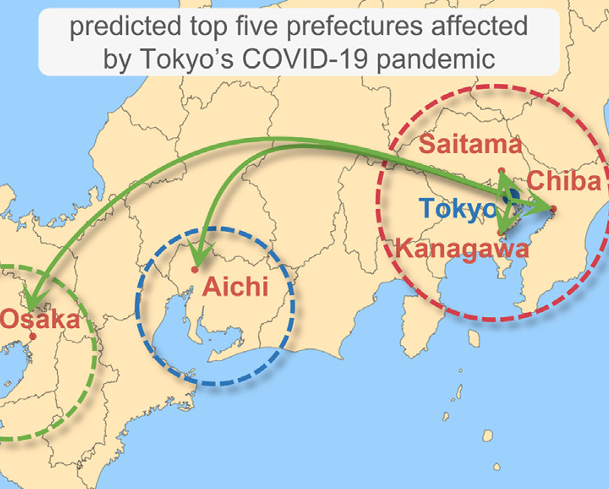

```{r, include=FALSE, eval=FALSE}
knitr::opts_chunk$set(
  collapse = TRUE,
  comment = "##",
  fig.path = "man/figures/edm/"
)
```

## 1. Introduction to the `tEDM` package

The `tEDM` package provides a suite of tools for exploring and quantifying causality in time series using Empirical Dynamic Modeling (EDM). It implements four fundamental EDM-based causal discovery methods:

- [**Convergent Cross Mapping (CCM)**][1]

- [**Partial Cross Mapping (PCM)**][2]

- [**Cross Mapping Cardinality (CMC)**][3] 

- [**Multispatial Convergent Cross Mapping (MultispatialCCM)**][4]

These methods enable researchers to:

- **Identify** potential causal interactions without assuming a predefined model structure.

- **Distinguish** between direct causation and indirect (mediated or confounded) influences.

- **Reconstruct** underlying causal dynamics from replicated univariate time series observed across multiple spatial units.

## 2. Example data in the `tEDM` package

### Hong Kong Air Pollution and Cardiovascular Admissions

A daily time series dataset for Hong Kong that includes cardiovascular hospital admissions and major air pollutant concentrations.

**File**: `cvd.csv`

**Columns**:

| Column | Description                                                 |
| ------ | ----------------------------------------------------------- |
| `cvd`  | Daily number of cardiovascular-related hospital admissions. |
| `rsp`  | Respirable suspended particulates (μg/m³).                  |
| `no2`  | Nitrogen dioxide concentration (μg/m³).                     |
| `so2`  | Sulfur dioxide concentration (μg/m³).                       |
| `o3`   | Ozone concentration (μg/m³).                                |

**Source**: Data adapted from [PCM article][2].

---

### US County-Level Carbon Emissions Dataset

A panel dataset covering U.S. county-level temperature and carbon emissions across time.

**File**: `carbon.csv.gz`

**Columns**:

| Column   | Description                                                              |
| -------- | ------------------------------------------------------------------------ |
| `year`   | Observation year (1981–2017).                                            |
| `fips`   | County FIPS code (5-digit Federal Information Processing Standard code). |
| `tem`    | Mean annual temperature (in Kelvin).                                     |
| `carbon` | Total carbon emissions per year (in kilograms of CO₂).                   |

**Source**: Data adapted from [FsATE article][5].

---

### COVID-19 Infection Counts in Japan

A spatio-temporal dataset capturing the number of confirmed COVID-19 infections across Japan’s 47 prefectures over time.

**File**: `covid.csv`

**Structure**:

* Each **column** represents one of the 47 Japanese prefectures (e.g., `Tokyo`, `Osaka`, `Hokkaido`).
* Each **row** corresponds to a time step (daily).

**Source**: Data adapted from [CMC article][3].

## 3. Case studies of the `tEDM` package

Install the stable version:

```r
install.packages("tEDM", dep = TRUE)
```

or dev version:

```r
install.packages("tEDM",
                 repos = c("https://stscl.r-universe.dev",
                           "https://cloud.r-project.org"),
                 dep = TRUE)
```

### Air Pollution and Cardiovascular Health in Hong Kong

```{r load_cvd_data}
library(tEDM)

cvd = readr::read_csv(system.file("case/cvd.csv",package = "tEDM"))
head(cvd)
```

Determining optimal embedding dimension:

```{r simplex_fnn}
tEDM::fnn(cvd,"cvd",E = 2:50,eps = stats::sd(cvd$cvd))
```

Starting at $E = 5$, the FNN ratio stabilizes near 0.2; thus, embedding dimension E and neighbor number k are chosen from 5 onward for subsequent self-prediction parameter selection.

```{r simplex_cvd}
tEDM::simplex(cvd,"cvd","cvd",E = 5:25,k = 6:35)
tEDM::simplex(cvd,"rsp","rsp",E = 5:25,k = 6:35)
tEDM::simplex(cvd,"no2","no2",E = 5:25,k = 6:35)
tEDM::simplex(cvd,"so2","so2",E = 5:25,k = 6:35)
tEDM::simplex(cvd,"o3","o3",E = 5:25,k = 6:35)
```

Employing CCM to investigate the causal relationships between various air pollutants and cardiovascular and cerebrovascular diseases

```{r pcm_cvd, eval=FALSE}
p1 = pcm(cvd,"rsp","cvd",c("no2","so2","o3"),
         libsizes = seq(10,1300,100), E = 2,tau = 1,k = c(5,7))
pcm(cvd,"no2","cvd",libsizes = seq(10,1300,100),E = 2,tau = 1,k = c(5,7))
pcm(cvd,"so2","cvd",libsizes = seq(10,1300,100),E = 2,tau = 1,k = c(5,7))
pcm(cvd,"o3","cvd",libsizes = seq(10,1300,100),E = 2,tau = 1,k = c(5,7))
```

### US County Carbon Emissions and Temperature Dynamics

```{r load_carbon_data}
library(tEDM)

carbon = readr::read_csv(system.file("case/carbon.csv.gz",package = "tEDM"))
head(carbon)
```

To examine whether a causal relationship exists between annual mean temperature and total annual CO₂ emissions, we implement the CMC method across counties.

```{r carbon_process}
carbon_list = dplyr::group_split(carbon, by = fips)
length(carbon_list)
```

Using the 100th county as an example, we determine the appropriate embedding dimension by applying the FNN method.

```{r carbon_fnn}
tEDM::fnn(carbon_list[[100]],"carbon",E = 2:10,tau = 0,eps = stats::sd(carbon_list[[100]]$carbon))
```

When E equals 6, the FNN ratio begins to drop to zero; therefore, we select $E = 6$ as the embedding dimension for the CMC analysis.

```{r carbon_cmc}
res = carbon_list |> 
  purrr::map_dfr(\(.x) {
    g = tEDM::cmc(.x,"tem","carbon",E = 6,tau = 0,k = 20,progressbar = FALSE)
    return(g$xmap)
  })
head(res)

res_carbon = res |> 
  dplyr::select(neighbors,
                carbon_tem = x_xmap_y_mean,
                tem_carbon = y_xmap_x_mean) |> 
  tidyr::pivot_longer(c(carbon_tem, tem_carbon), 
                      names_to = "variable", values_to = "value")
head(res_carbon)
```

```{r fig_case2,fig.width=4.5,fig.height=4.5,fig.dpi=100,fig.cap=knitr::asis_output("**Figure 3**. Causal strength scores between annual mean temperature and total annual $CO_2$ emissions across US counties, with embedding dimension E set to 6 and number of neighbors set to 20.")}
fig_case2 = ggplot2::ggplot(res_carbon, 
                            ggplot2::aes(x = variable, y = value, fill = variable)) +
  ggplot2::geom_boxplot() +
  ggplot2::theme_bw() +
  ggplot2::labs(x = "", y = "Causal Strength") +
  ggplot2::scale_x_discrete(labels = c("carbon_tem" = "carbon → tem",
                                       "tem_carbon" = "tem → carbon")) +
  ggplot2::theme(legend.position = "none")
fig_case2
```

### COVID-19 Spread Across Japanese Prefectures

We examine the COVID-19 transmission between Tokyo and other prefectures by applying CCM to identify the underlying causal dynamics of the epidemic spread

```{r load_covid_data}
library(tEDM)

covid = readr::read_csv(system.file("case/covid.csv",package = "tEDM"))
head(covid)
```

The data are first differenced:

```{r}
covid = covid |> 
  dplyr::mutate(dplyr::across(dplyr::everything(),
                              \(.x) c(NA,diff(.x))))
```

Using Tokyo's COVID-19 infection data to test the optimal embedding dimension.

```{r covid_fnn}
tEDM::fnn(covid,"Tokyo",E = 2:30,eps = stats::sd(covid$Tokyo))
```

Since the FNN ratio begins to approach zero when E equals 11, embedding dimensions from 11 onward are evaluated, and the pair of E and k yielding the highest self-prediction accuracy is selected for the CCM procedure.

```{r covid_simplex}
tEDM::simplex(covid,"Tokyo","Tokyo",E = 11:50,k = 15:60)
```

```{r covid_ccm}
res = names(covid)[-match("Tokyo",names(covid))] |> 
  purrr::map_dfr(\(.l) {
    g = tEDM::ccm(covid,"Tokyo",.l,E = 11,k = 16,tau = 0,progressbar = FALSE)
    res = dplyr::mutate(g$xmap,x = "Tokyo",y = .l)
    return(res)
  })
head(res)

df1 = res |>
    dplyr::select(x,y,y_xmap_x_mean,y_xmap_x_sig)|>
    purrr::set_names(c("cause","effect","cs","sig"))
df2 = res |>
    dplyr::select(y,x,x_xmap_y_mean,x_xmap_y_sig) |>
    purrr::set_names(c("cause","effect","cs","sig"))
res_covid = dplyr::bind_rows(df1,df2)|> 
  dplyr::filter(cause == "Tokyo") |> 
  dplyr::arrange(dplyr::desc(cs))
head(res_covid,5)
```

Our CCM analysis reproduced the same results as the [original CMC study][3], with the top five prefectures most affected by Tokyo’s COVID-19 spread matching those previously identified.

```{r fig_case3,echo=FALSE,fig.width=6,fig.height=4.9,fig.dpi=100,fig.cap=knitr::asis_output("**Figure 4**. The five prefectures most affected by Tokyo, Kanagawa, Osaka, Saitama, Chiba, and Aichi, are located on the map. Red, blue and green dashed rings represent Tokyo, Nagoya and Osaka metropolitan areas, respectively. (*Figure adapted from [CMC article][3].*)")}

```

## Reference

Sugihara, G., May, R., Ye, H., Hsieh, C., Deyle, E., Fogarty, M., Munch, S., 2012. Detecting Causality in Complex Ecosystems. Science 338, 496–500. [https://doi.org/10.1126/science.1227079][1].

Leng, S., Ma, H., Kurths, J., Lai, Y.-C., Lin, W., Aihara, K., Chen, L., 2020. Partial cross mapping eliminates indirect causal influences. Nature Communications 11. [https://doi.org/10.1038/s41467-020-16238-0][2].

Tao, P., Wang, Q., Shi, J., Hao, X., Liu, X., Min, B., Zhang, Y., Li, C., Cui, H., Chen, L., 2023. Detecting dynamical causality by intersection cardinal concavity. Fundamental Research. [https://doi.org/10.1016/j.fmre.2023.01.007][3].

Clark, A.T., Ye, H., Isbell, F., Deyle, E.R., Cowles, J., Tilman, G.D., Sugihara, G., 2015. Spatial convergent cross mapping to detect causal relationships from short time series. Ecology 96, 1174–1181. [https://doi.org/10.1890/14-1479.1][4].

Gan, T., Succar, R., Macrì, S., Marín, M.R., Porfiri, M., 2025. Causal discovery from city data, where urban scaling meets information theory. Cities 162, 105980. [https://doi.org/10.1016/j.cities.2025.105980][5].

&nbsp; 

[1]: https://doi.org/10.1126/science.1227079
[2]: https://doi.org/10.1038/s41467-020-16238-0
[3]: https://doi.org/10.1016/j.fmre.2023.01.007
[4]: https://doi.org/10.1890/14-1479.1
[5]: https://doi.org/10.1016/j.cities.2025.105980
